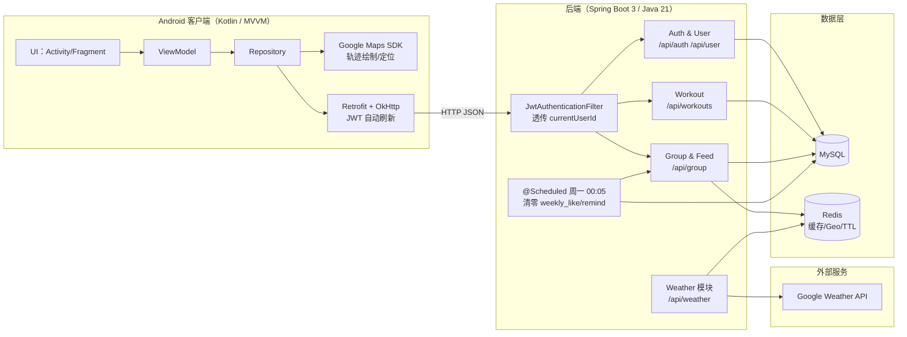

# Run-With-Me · 跑步社交小项目

Run-With-Me 是一个“跑步 + 社交”的移动端小项目：用 Android 记录轨迹与跑步数据，用后端把“人与人之间的运动连接”做成可用的群组与激励机制。

- 客户端：Android（Kotlin）
- 后端：Spring Boot（Java 21）
- 存储：MySQL
- 缓存：Redis（含 Geo + TTL）

代码目录约定：安卓在 `app/`；后端在 `backend/`。

---

## 业务能力（宏观）

- 🏃 跑步记录：定位采样、轨迹绘制、距离/时长/速度等指标统计
- 👥 群组社交：创建/加入/退出群组；入群申请与审核；成员互动（like / remind）
- 📰 Feed 与通知：面向群组的动态流（feed）与通知列表
- 🏆 周常机制：按周统计互动次数，周一自动清零，保证挑战公平
- ☕ Coffee Bonus 激励：群组成员完成周计划积累积分，每 100 分兑换一张咖啡券；全员完成可获得 10 分全勤奖励
- 🤖 AI 智能建议：基于当前天气（温度/风速/湿度）+ 训练历史生成个性化运动建议（集成 Gemini AI）
- ☀️ 天气服务：根据经纬度获取天气信息（后端封装 Google Weather API）

---

## 技术选型（微观）

### Android（`app/`）

- Kotlin + 组件化页面（Activity/Fragment）
- Google Play Services：定位与地图（轨迹 polyline 绘制）
- Retrofit + OkHttp：请求封装、鉴权 header 注入
- Token 自动刷新：兼容两种失效信号
   - HTTP 401
   - HTTP 200 但业务码 `Result.code == 401`

### 后端（`backend/rwm/`）

- Spring Boot 3.x + Java 21
- MyBatis-Plus：数据访问
- JWT：无状态鉴权
- Redis：缓存与地理索引
- 统一响应：`Result<T>`（见 `backend/rwm/src/main/java/com/rwm/dto/response/Result.java`）

> 约定：请求参数正确且无异常时统一返回 `200 OK`，成功与否由 `Result.code` 表达（`0` 成功，其他为业务失败/不完全成功）。

---

## 系统架构（含设计巧思）

项目组件简单（客户端、后端、DB、Redis），但在关键链路做了可解释的工程化设计：

1. **统一响应模型**：后端保持 HTTP 层稳定（通常 `200 OK`），减少客户端对 HTTP 状态的分支依赖；客户端以 `Result.code` 作为业务判定。
2. **鉴权透传**：`JwtAuthenticationFilter` 校验 token 后向 request 注入 `currentUserId/currentUsername`，Controller/Service 使用它做“归属权/权限”强校验。
3. **天气缓存（Redis Geo + TTL）**：天气模块用 GEO 做“就近命中”（同城/邻近坐标可复用），用 TTL 让 Redis 自动淘汰，避免缓存堆积。
4. **周常一致性**：通过 `@Scheduled` 任务在每周一 00:05 批量清零周统计字段，保证新一周起点一致。
5. **Coffee Bonus 游戏化激励**：群组内每位成员完成周计划贡献 15 分，全员完成额外 10 分；积分达 100 自动兑换咖啡券（进位制，余数保留）；通过 `ConcurrentHashMap` 按 `groupId` 细粒度加锁防止并发重复加分；严格校验机制保证每人每周只能为一个群组贡献、每组每周只发放一次全勤奖励。
6. **AI 运动建议引擎**：客户端集成 Gemini AI SDK；根据实时天气（温度、湿度、风速）生成个性化运动建议（Prompt 工程模板化）；支持基于训练历史、阶段性数据的多场景 Prompt 扩展。


---

## 业务亮点深度解析

### 1. Coffee Bonus 游戏化激励机制

#### 设计思路
将群组协作游戏化：成员通过完成周计划积累"积分"，达到 100 分兑换一张咖啡券（虚拟激励道具）。全员完成周计划可获得 10 分全勤奖励，增强群组凝聚力。

**核心约束**：
- 每人每周只能为**一个**群组贡献积分（防止"打工人"为多个群组刷分）
- 每个群组每周只能获得**一次**全勤奖励（防止重复触发）
- 同一用户在同一群组同一周重复完成计划时，不重复加分（幂等性保障）

#### 实现细节
- **积分规则**：
  - 每位成员首次完成周计划：+15 分
  - 全员完成检测：额外 +10 分（每周仅发放一次）
  - 每 100 分自动兑换 1 张咖啡券，余数保留至下周
  
- **并发安全保障**：
  ```java
  // 使用 ConcurrentHashMap 按 groupId 细粒度加锁
  private static final ConcurrentHashMap<Long, Object> GROUP_LOCKS = new ConcurrentHashMap<>();
  
  Object lock = GROUP_LOCKS.computeIfAbsent(gid, k -> new Object());
  synchronized (lock) {
      // 积分计算 + 全勤检测 + 券兑换
  }
  ```
  
- **全勤检测算法**：
  ```java
  // 遍历所有当前成员，检查本周贡献记录
  QueryWrapper<GroupMember> mq = new QueryWrapper<>();
  mq.eq("group_id", gid).eq("deleted", false);
  List<GroupMember> members = groupMemberMapper.selectList(mq);
  
  int completed = 0;
  for (GroupMember m : members) {
      QueryWrapper<UserWeeklyContribution> mq2 = new QueryWrapper<>();
      mq2.eq("user_id", m.getUserId()).eq("week_start", ws);
      UserWeeklyContribution mc = userWeeklyContributionMapper.selectOne(mq2);
      if (mc != null && Boolean.TRUE.equals(mc.getIndividualCompleted())) {
          completed++;
      }
  }
  
  // 全员完成且人数 > 0，发放全勤奖励
  if (completed == members.size() && members.size() > 0) {
      stats.setWeeklyPoints(stats.getWeeklyPoints() + 10);
      stats.setFullAttendanceBonusApplied(true);
  }
  ```

- **兑换逻辑**：
  ```java
  // 进位制：每 100 分兑换 1 券，余数保留
  int couponsEarned = stats.getWeeklyPoints() / 100;
  int remainder = stats.getWeeklyPoints() % 100;
  if (couponsEarned > 0) {
      stats.setCouponEarned(couponsEarned);
      stats.setWeeklyPoints(remainder);
      
      Group g = groupMapper.selectById(gid);
      g.setCouponCount(g.getCouponCount() + couponsEarned);
      groupMapper.updateById(g);
  }
  ```

- **防重复机制**：
  - 同一用户同一周只能贡献一次 15 分（通过 `UserWeeklyContribution` 表的 `individualCompleted` 标记）
  - 全勤奖励每周只发放一次（通过 `fullAttendanceBonusApplied` 标记）

- **严格校验机制**：
  ```java
  // 1. 每人每周只能为一个群组贡献
  QueryWrapper<UserWeeklyContribution> uq = new QueryWrapper<>();
  uq.eq("user_id", userId).eq("week_start", ws);
  UserWeeklyContribution c = userWeeklyContributionMapper.selectOne(uq);
  if (c != null && !Objects.equals(c.getGroupId(), gid)) {
      throw new RuntimeException("Weekly contribution already made for another group");
  }
  
  // 2. 用户已完成本周贡献，直接返回（幂等性）
  if (Boolean.TRUE.equals(c.getIndividualCompleted())) {
      return;  // 不重复加分
  }
  
  // 3. 全勤奖励一周只发放一次
  if (!Boolean.TRUE.equals(stats.getFullAttendanceBonusApplied())) {
      // 检测全员完成后才发放
      if (completed == members.size() && members.size() > 0) {
          stats.setWeeklyPoints(stats.getWeeklyPoints() + 10);
          stats.setFullAttendanceBonusApplied(true);  // 标记已发放
      }
  }
  ```

- **数据库约束保障**：
  - `UserWeeklyContribution` 表记录用户每周的群组贡献（`user_id` + `week_start` 唯一索引）
  - `GroupWeeklyStats` 表记录群组每周统计（`group_id` + `week_start` 唯一索引）
  - 防止同一用户同一周为多个群组贡献
  - 防止同一群组同一周重复发放全勤奖励

#### 前端展示
- 客户端实时展示 Coffee Progress（0-100 进度条 + 咖啡杯图标）
- 兑换成功时弹窗祝贺："Your group won X free coffee coupon(s)! ☕"

---

### 2. AI 智能运动建议

#### 功能定位
基于实时天气条件（温度、湿度、风速、天气状况）和用户训练历史，生成个性化的运动建议，帮助用户做出更科学的运动决策。

#### 技术实现

**客户端集成（Kotlin + Gemini AI SDK）**：
```kotlin
// 使用 Gemini 2.5 Flash Lite 模型
private val client: Client by lazy {
    Client.builder()
        .apiKey(apiKey)
        .build()
}

// 天气建议生成
suspend fun getWeatherBasedAdvice(
    temperature: Double,
    weatherCondition: String,
    windSpeed: Double,
    humidity: Int
): Result<String> {
    val prompt = PromptTemplate.getWeatherBasedAdvice(
        temperature, weatherCondition, windSpeed, humidity
    )
    return generateContent(prompt)
}
```

**Prompt 工程模板化**：
```kotlin
fun getWeatherBasedAdvice(
    temperature: Double,
    weatherCondition: String,
    windSpeed: Double,
    humidity: Int
): String {
    return """
        You are a professional fitness coach. Based on the following weather conditions, 
        provide brief exercise advice in exactly 2 sentences.
        
        Weather Information:
        - Temperature: ${temperature}°C
        - Condition: $weatherCondition
        - Wind Speed: ${windSpeed} km/h
        - Humidity: ${humidity}%
        
        Requirements:
        1. First sentence: Recommend the best type of outdoor exercise for these conditions
        2. Second sentence: Provide one practical preparation tip
        
        Keep it concise, friendly, and actionable.
    """.trimIndent()
}
```

**多场景支持**：
- **天气场景**：`getWeatherBasedAdvice` - 根据当前天气推荐运动类型与准备建议
- **训练历史场景**：`getWorkoutHistoryAdvice` - 基于近期跑步数据（距离、配速、频率）分析训练水平并提供改进建议
- **阶段性分析**：`getPeriodBasedAdvice` - 结合用户画像（年龄、性别、健身目标）与今日/本周/本月训练数据生成个性化建议

#### 前端交互流程
1. 用户打开首页，自动获取当前位置天气
2. 显示加载状态："Generating personalized exercise advice..."
3. Gemini AI 生成建议（2-3 秒内）
4. 展示在首页醒目位置，用户可随时查看

#### 扩展性
- 模板化设计使得新增建议场景只需添加新的 Prompt 函数
- 支持多语言 Prompt（当前为英文，可扩展中文）
- 可集成用户反馈机制，持续优化 Prompt 质量

---

## 代码地图（从入口到落库）

### Android

- **跑步轨迹绘制**：[app/src/main/java/com/example/myapplication/record/RecordingFragment.kt](app/src/main/java/com/example/myapplication/record/RecordingFragment.kt)
- **网络与鉴权**：[app/src/main/java/com/example/myapplication/landr/RetrofitClient.kt](app/src/main/java/com/example/myapplication/landr/RetrofitClient.kt)
  - 默认 `BASE_URL = http://10.0.2.2:8080/`（模拟器访问宿主机）
  - 自动注入 `Authorization: Bearer <accessToken>`
  - 自动刷新 token（见拦截器逻辑）
- **群组接口**：[app/src/main/java/com/example/myapplication/group/GroupApi.kt](app/src/main/java/com/example/myapplication/group/GroupApi.kt)
- **AI 建议模块**：
  - [app/src/main/java/com/example/myapplication/gemini/GeminiApiService.kt](app/src/main/java/com/example/myapplication/gemini/GeminiApiService.kt)（封装 Gemini SDK 调用）
  - [app/src/main/java/com/example/myapplication/gemini/PromptTemplate.kt](app/src/main/java/com/example/myapplication/gemini/PromptTemplate.kt)（Prompt 工程模板）
  - [app/src/main/java/com/example/myapplication/HomeFragment.kt](app/src/main/java/com/example/myapplication/HomeFragment.kt)（天气 + AI 建议集成）

### 后端

- **JWT 过滤器**：[backend/rwm/src/main/java/com/rwm/filter/JwtAuthenticationFilter.java](backend/rwm/src/main/java/com/rwm/filter/JwtAuthenticationFilter.java)
- **周常清零**：[backend/rwm/src/main/java/com/rwm/schedule/WeeklyCountersResetTask.java](backend/rwm/src/main/java/com/rwm/schedule/WeeklyCountersResetTask.java)
- **控制器入口**：
  - [backend/rwm/src/main/java/com/rwm/controller/AuthController.java](backend/rwm/src/main/java/com/rwm/controller/AuthController.java)
  - [backend/rwm/src/main/java/com/rwm/controller/WorkoutController.java](backend/rwm/src/main/java/com/rwm/controller/WorkoutController.java)
  - [backend/rwm/src/main/java/com/rwm/controller/GroupController.java](backend/rwm/src/main/java/com/rwm/controller/GroupController.java)
- **Coffee Bonus 核心逻辑**：[backend/rwm/src/main/java/com/rwm/service/impl/GroupServiceImpl.java](backend/rwm/src/main/java/com/rwm/service/impl/GroupServiceImpl.java)
  - `completeWeeklyPlan()` 方法：成员完成周计划，+15 分；全员完成检测，+10 分全勤奖励
  - 每 100 分自动兑换咖啡券，余数保留
  - 细粒度锁：`ConcurrentHashMap<Long, Object>` 按 `groupId` 锁，防止并发重复加分
  - 严格校验：每人每周只能为一个群组贡献、幂等性保障
- **数据库表结构**（MySQL）：
  - `groups`：群组基本信息（`coupon_count` 记录总券数）
  - `group_weekly_stats`：群组周统计（`weekly_points`、`full_attendance_bonus_applied`）
  - `user_weekly_contribution`：用户周贡献记录（`user_id` + `week_start` 唯一索引，防止跨组贡献）
  - `group_member`：群组成员表（`weekly_like_count`、`weekly_remind_count`）
- **天气模块**：[backend/rwm/src/main/java/com/rwm/weather/](backend/rwm/src/main/java/com/rwm/weather/)
  - Redis GEO 缓存：[backend/rwm/src/main/java/com/rwm/weather/cache/WeatherGeoCacheService.java](backend/rwm/src/main/java/com/rwm/weather/cache/WeatherGeoCacheService.java)
  - 模块文档：[backend/rwm/src/main/java/com/rwm/weather/README.md](backend/rwm/src/main/java/com/rwm/weather/README.md)

### 先决条件

- JDK 21
- Android Studio（建议最新版稳定版）
- MySQL、Redis（本机或远程均可）

### 启动后端

在 `backend/rwm/` 目录：

```bash
./mvnw clean package
./mvnw spring-boot:run
```

默认地址：`http://localhost:8080`

配置：`backend/rwm/src/main/resources/application.properties`

### 启动客户端

用 Android Studio 打开本项目，Gradle Sync 后运行。

#### 模拟器

默认可用：`BASE_URL = http://10.0.2.2:8080/`。

#### 真机

把 `RetrofitClient.kt` 的 `BASE_URL` 改成后端机器的局域网 IP，例如：

```kotlin
private const val BASE_URL = "http://192.168.1.23:8080/"
```

并确保手机与后端在同一 Wi‑Fi，且防火墙允许 8080 端口。

---

## 常见问题

- 客户端收到 `200` 但提示失败/未登录：检查 `Result.code`（后端以业务码表达错误）；客户端已实现 `code==401` 的自动刷新逻辑。
- 天气接口失败：需要配置 Google Weather API Key，按天气模块文档补齐配置。
